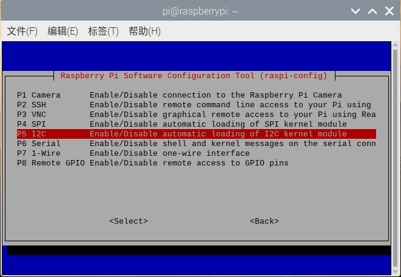
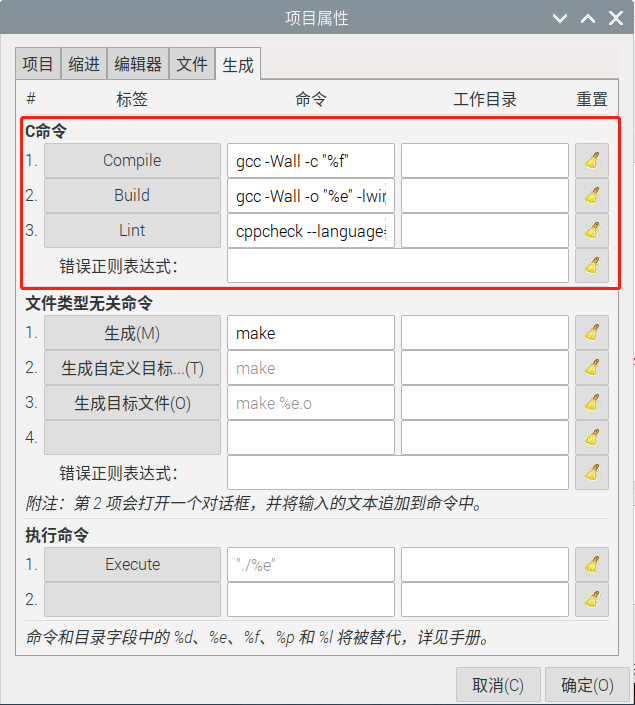

# RaspberryPi-Sensor-Board
[中文版](README_zh.md)

 [Emakefun]](http://www.emakefun.com)


## Feature

- Support 8-channel ADC detection
- Built-in MCU
- Support Raspberry Pi 2B/3B/3B+/4/zero
- 5.5x2.1 DC head and terminal power supply
- Freely switch between external sensor voltage 3V3 and 5V
- Onboard DC-DC step-down chip Wide voltage input: 5 ~ 36V Voltage output: 5V Maximum current output: 3A

## MCU specifications
-Onboard DC-DC step-down chip Wide voltage input: 5 ~ 36V Voltage output: 5V Maximum current output: 3A
- MCU :STM32
- IO: 8-channel ADC detection
- Communication method with Raspberry Pi: I2C
- I2C address: 0x04

## Hardware Preview
图片

## Register

&ensp;&ensp;&ensp;&ensp;The MCU I2C address of the expansion board is 0x04, and the registered address is explained as follows:


  - 0x10 ~ 0x17: read ADC raw data

  - 0x20 ~ 0x27: read input voltage

  - 0x30 ~ 0x37: Read the ratio of input voltage to output voltage Input voltage / output voltage

##    Raspberry Pi I2C library installation

&ensp;&ensp;&ensp;&ensp;Open the Raspberry Pi terminal and enter the "sudo raspi-config" command, then follow the sequence shown below.





&ensp;&ensp;&ensp;&ensp;The above is to open the Raspberry Pi I2C. Next, we install the Raspberry I2C library and type "sudo apt-get install i2c-tools" in the terminal. After the input is complete, you can see that the I2C library is being downloaded. After the installation is complete, you can enter " sudo i2cdetect -l "detects whether the installation is correct. If a message similar to the following appears, the installation is normal.


&ensp;&ensp;&ensp;&ensp;Enter "sudo i2cdetect -y 1" command in the terminal to scan all I2C devices connected to the I2C bus and print out the I2C bus address of the device, and the I2C address of our expansion board is 0x04.


## Read ADC analog value

&ensp;&ensp;&ensp;&ensp;As we all know, there is no ADC in Raspberry Pi, so the analog value of the sensor cannot be read directly. With the help of the MCU STM32 built into the expansion board, a 12-bit ADC can be read. This means that analog sensors can be used on the Raspberry Pi, and there are a total of 8 available interfaces.

&ensp;&ensp;&ensp;&ensp;The analog sensor inputs the analog voltage to the 12-bit analog-to-digital converter. After the analog-to-digital converter converts the analog data to digital data, the digital data is input to the Raspberry Pi via I2C.


### Python code

```
    import time
    import smbus2 as smbus
    ADC=smbus.SMBus(1)#Declare to use I2C 1
    
    while True:
     ADC.write_byte(0x04,0x20)#Write a byte to the slave
     print(ADC.read_word_data(0x04,0x20))#Raspberry Pi reads the data returned by the expansion board and prints it out
     tiem.sleep(1)#Delay 1 second
```

### C code

```
    #include<stdio.h>//Import basic library
    #include<wiringPi.h>//Import Raspberry Pi WiringPi encoding IO control library
    #include<wiringPiI2C.h>//Import Raspberry Pi WiringPi coded I2C control library
    int value;//Define a variable
    int main (void){
        wiringPiSetup();//Initialize WiringPi encoding.
        wiringPiI2CSetup(0x04);//Open the I2C device, 0x04 is the MCU I2C address on the expansion board
        while(1){
            wiringPiI2CWrite(0x04,0x20);//Write a byte to the slave
            value = wiringPiI2CReadReg16(0x04,0x20);//Read two bytes from the specified address of the slave and assign it to value
            printf("%d\r\n",value);//Print value
            delay(100);
        }
    }
```

&ensp;&ensp;&ensp;&ensp;If the following error occurs while generating the current file：


&ensp;&ensp;&ensp;&ensp;If this problem occurs, please modify the generated command and enter the settings below：

&ensp;&ensp;&ensp;&ensp;&ensp;&ensp;&ensp;&ensp;Compile&ensp;&ensp;&ensp;&ensp;&ensp;&ensp;&ensp;&ensp;g

cc -Wall -c "%f"

&ensp;&ensp;&ensp;&ensp;&ensp;&ensp;&ensp;&ensp;Build&ensp;&ensp;&ensp;&ensp;&ensp;&ensp;&ensp;&ensp;gcc 

-Wall -o "%e" -lwiringPi "%f"

&ensp;&ensp;&ensp;&ensp;&ensp;&ensp;&ensp;&ensp;Lint&ensp;&ensp;&ensp;&ensp;&ensp;&ensp;&ensp;&ensp;cppc

heck --language=c --enable=warning,style --template=gcc "%f"


