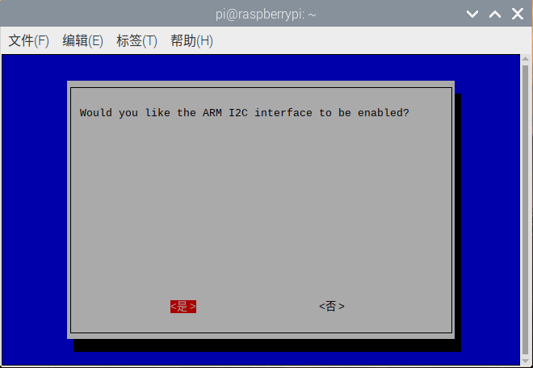
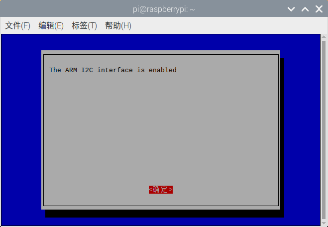
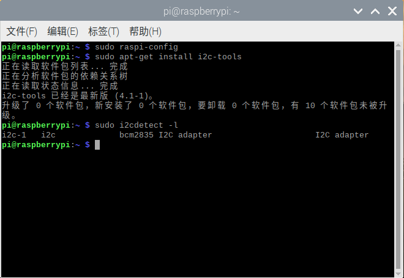
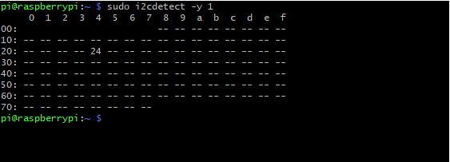

# RaspberryPi-Sensor-Board

 [深圳市易创空间科技有限公司](http://www.emakefun.com)出品
图片


## 特点

- 支持8路ADC检测
- 内置MCU
- 支持树莓派 2B/3B/3B+/4/zero
- 5.5x2.1DC头与接线端子供电
- 外接传感器电压3V3与5V自由切换
- 板载DC-DC降压芯片    宽电压输入：5~36V     电压输出：5V     最大电流输出: 3A

## MCU规格
- 工作电压：3.3V
- MCU :STM32
- IO: 8路ADC检测
- 与树莓派通信方式: I2C
- I2C地址： 0x04

## 硬件概述
图片

## 寄存器

&ensp;&ensp;&ensp;&ensp;扩展板MCU I2C地址为0x04，寄存地址说明如下：


  - 0x10 ~ 0x17: 读取ADC原始数据

  - 0x20 ~ 0x27: 读取输入电压

  - 0x30 ~ 0x37: 读取输入电压与输出电压的比   输入电压/输出电压

##    树莓派I2C库安装

&ensp;&ensp;&ensp;&ensp;打开树莓派终端输入"sudo raspi-config"命令，然后按照下图顺序依次操作即可。






&ensp;&ensp;&ensp;&ensp;以上就是开启树莓派I2C，接下来我们安装树莓I2C库在终端输入“sudo apt-get install i2c-tools”，输入完成后就可以看到正在下载I2C库，安装完成之后可以在终端输入“sudo i2cdetect -l”检测是否安装正确，若出现类似于下面的信息就说明安装正常。



&ensp;&ensp;&ensp;&ensp;在终端输入“sudo i2cdetect -y 1”命令即可扫描接在I2C总线上的所有I2C设备，并打印出该设备的I2C总线地址，且我们的扩展板的I2C地址为0x04。



## 读取ADC模拟值

&ensp;&ensp;&ensp;&ensp;众所周知，Raspberry Pi中没有ADC，因此不能直接读取传感器的模拟值。在扩展板内置的MCU STM32的帮助下可以读取12位ADC这就意味着可以在树莓派上使用模拟传感器，且一共有8个可用的接口。

&ensp;&ensp;&ensp;&ensp;模拟传感器将模拟电压输入12位模数转换器。模数转换器将模拟数据转换成数字数据后，通过I2C将数字数据输入到树莓派中。


### Python代码

```
    import time
    import smbus2 as smbus
    ADC=smbus.SMBus(1)#声明使用I2C 1
    
    while True:
     ADC.write_byte(0x04,0x20)#往从机写一个字节
     print(ADC.read_word_data(0x04,0x20))#树莓派读取扩展板返回回来的数据并打印出来
     tiem.sleep(1)#延时1秒
```

### C代码

```
    #include<stdio.h>//导入基础库
    #include<wiringPi.h>//导入树莓派WiringPi编码IO控制库
    #include<wiringPiI2C.h>//导入树莓派WiringPi编码I2C控制库
    int value;//定义一个变量
    int main (void){
        wiringPiSetup();//初始化WiringPi编码。
        wiringPiI2CSetup(0x04);//打开I2C设备,0x04为扩展板上MCU I2C地址
        while(1){
            wiringPiI2CWrite(0x04,0x20);//往从机写一个字节
            value = wiringPiI2CReadReg16(0x04,0x20);//读取从机指定地址的两个字节，并赋值给value
            printf("%d\r\n",value);//打印value
            delay(100);
        }
    }
```

&ensp;&ensp;&ensp;&ensp;如果在生成当前文件时出现以下错误：


&ensp;&ensp;&ensp;&ensp;如果出现这种问题时请修改生成命令入下图设置：

&ensp;&ensp;&ensp;&ensp;&ensp;&ensp;&ensp;&ensp;Compile&ensp;&ensp;&ensp;&ensp;&ensp;&ensp;&ensp;&ensp;gcc -Wall -c "%f"

&ensp;&ensp;&ensp;&ensp;&ensp;&ensp;&ensp;&ensp;Build&ensp;&ensp;&ensp;&ensp;&ensp;&ensp;&ensp;&ensp;gcc -Wall -o "%e" -lwiringPi "%f"

&ensp;&ensp;&ensp;&ensp;&ensp;&ensp;&ensp;&ensp;Lint&ensp;&ensp;&ensp;&ensp;&ensp;&ensp;&ensp;&ensp;cppcheck --language=c --enable=warning,style --template=gcc "%f"


